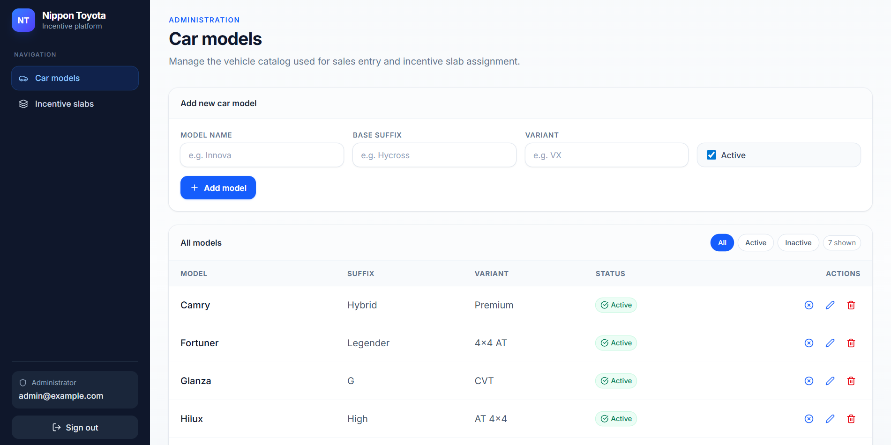
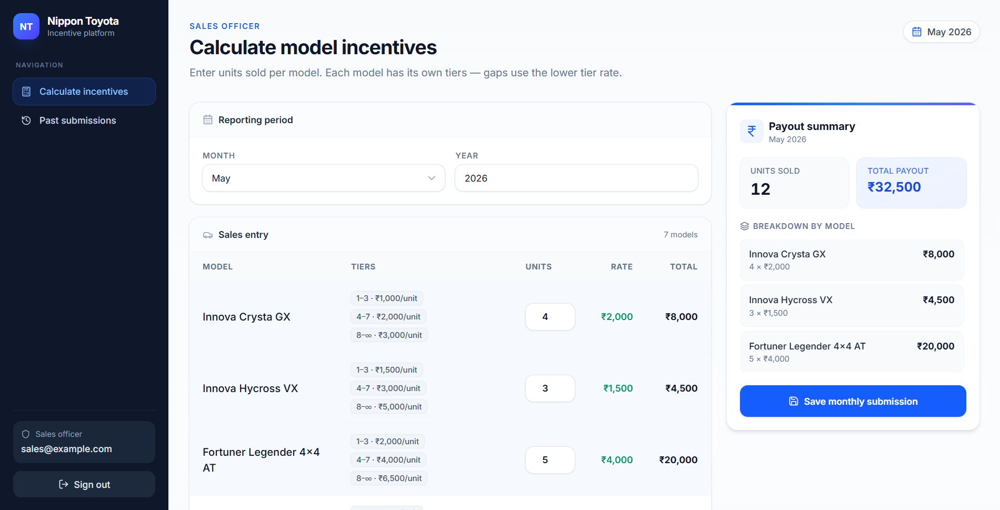

<div align="center">

# 💰 Nippon Incentive Platform

**A full-stack incentive calculator with dynamic slab admin panel for Nippon Toyota sales teams.**

Real-time calculation · Role-based authentication · Dynamic slab configuration · Responsive design

<br />

[](https://react.dev)
[](https://spring.io/projects/spring-boot)
[](https://tailwindcss.com)
[](https://www.postgresql.org)
[](LICENSE)

</div>

---

## 📖 Overview

Incentive Engine is a production-grade web application built for Nippon Toyota to streamline monthly incentive calculations for their sales officers. Administrators configure car models and tiered incentive slabs; sales officers log units sold and get real-time payout breakdowns — all secured with JWT-based role authentication.

---

## 🔗 Live Demo

> **[▶ View Live Project](https://nippon-incentive-platform.onrender.com/)**

| Role | Email | Password |
|---|---|---|
| Administrator | admin@example.com | admin123 |
| Sales Officer | sales@example.com | sales123 |

> ⚠️ Backend hosted on Render free tier — may take 30–40s on first load.

---

## ✨ Features

| Feature | Details |
|---|---|
| 🔐 **Role-Based Auth** | JWT-secured login for ADMIN and SALES_OFFICER roles |
| 🚗 **Car Model Management** | Add, edit, deactivate models with inline status toggle |
| 📊 **Dynamic Slab Engine** | Per-model tiered incentives (e.g. 1–3 units = ₹1000, 4–7 = ₹2000) |
| 🧮 **Real-Time Calculator** | Instant breakdown per model with debounced server sync |
| 📋 **Submission History** | Expandable per-model breakdown on every saved submission |
| 🔄 **Upsert Submissions** | Resubmitting a period updates the existing record — no duplicates |
| 📱 **Fully Responsive** | Desktop table + mobile card layout on every screen |

---

## 🛠️ Tech Stack

| Layer | Technology |
|---|---|
| **Frontend** | React 19, Vite, Tailwind CSS v4 |
| **HTTP Client** | Axios with JWT interceptors |
| **Routing** | React Router v7 |
| **Notifications** | React Hot Toast |
| **Icons** | Lucide React |
| **Backend** | Spring Boot 3, Spring Security, Spring Data JPA |
| **Auth** | JWT (stateless, BCrypt password encoding) |
| **Database** | PostgreSQL 16 (Neon) |
| **Deployment** | Docker → Docker Hub → Render |

---

## 📸 Screenshots

<div align="center">
  <h3>Admin — Incentive Slab Configuration</h3>
  

  <h3>Sales — Real-Time Incentive Calculator</h3>
  
</div>

---

## 📁 Project Structure

```
incentive-engine/
├── frontend/
│   ├── src/
│   │   ├── components/        # Reusable UI components
│   │   ├── context/           # AuthContext, DataContext
│   │   ├── pages/             # Admin and Sales pages
│   │   ├── utils/             # formatCar, formatCurrency, incentiveCalc
│   │   ├── api/               # Axios instance with interceptors
│   │   ├── App.jsx
│   │   └── main.jsx
│   ├── .env
│   ├── vite.config.js
│   └── package.json
│
├── backend/
│   └── src/main/java/com/nippon/incentive/
│       ├── controller/        # Auth, Admin, Sales REST controllers
│       ├── service/           # Business logic + incentive calculation
│       ├── repository/        # JPA repositories
│       ├── entity/            # CarModel, IncentiveSlab, SalesSubmission
│       ├── dto/               # Request/Response DTOs
│       ├── security/          # JWT filter, entry point, config
│       └── NipponIncentiveApplication.java
│   ├── src/main/resources/
│   │   └── application.properties
│   ├── Dockerfile
│   └── pom.xml
│
├── screenshots/
└── README.md
```

---

## 🚀 Local Setup

### Prerequisites

- Node.js ≥ 18
- Java 17+
- Maven 3.8+
- PostgreSQL 12+ (or a Neon cloud instance)

---

### Backend

```bash
# 1. Clone the repo
git clone https://github.com/Sreenand76/incentive-engine.git
cd incentive-engine/backend

# 2. Set environment variables (Windows CMD)
set DATASOURCE_URL=jdbc:postgresql://localhost:5432/nippon_incentive
set DATASOURCE_USER=postgres
set DATASOURCE_PASSWORD=your_password
set FRONTEND_URL=http://localhost:5173
set JWT_SECRET=your_jwt_secret_min_32_chars

# 3. Build and run
mvn clean package -DskipTests
mvn spring-boot:run
```

Backend starts on `http://localhost:8080`

---

### Frontend

```bash
cd ../frontend

# 1. Install dependencies
npm install

# 2. Configure environment
echo "VITE_API_BASE_URL=http://localhost:8080" > .env

# 3. Start dev server
npm run dev
```

Frontend available at `http://localhost:5173`

---

## 🐳 Docker Deployment

```bash
# Build jar
mvn clean package -DskipTests

# Build and push image
docker build -t your-dockerhub-username/incentive-engine:latest .
docker push your-dockerhub-username/incentive-engine:latest
```

On Render → New Web Service → Deploy existing image → set environment variables:

```
DATASOURCE_URL       jdbc:postgresql://your-neon-host/neondb?sslmode=require
DATASOURCE_USER      your_db_user
DATASOURCE_PASSWORD  your_db_password
FRONTEND_URL         https://your-frontend.vercel.app
JWT_SECRET           your_jwt_secret
```

---

## 📡 API Reference

### Auth
| Method | Endpoint | Description |
|---|---|---|
| POST | `/api/auth/login` | Authenticate and receive JWT |

### Admin
| Method | Endpoint | Description |
|---|---|---|
| GET | `/api/admin/cars` | List all car models |
| POST | `/api/admin/cars` | Create car model |
| PUT | `/api/admin/cars/{id}` | Update car model |
| DELETE | `/api/admin/cars/{id}` | Delete car model |
| GET | `/api/admin/slabs` | List all incentive slabs |
| POST | `/api/admin/slabs` | Create incentive slab |
| PUT | `/api/admin/slabs/{id}` | Update incentive slab |
| DELETE | `/api/admin/slabs/{id}` | Delete incentive slab |

### Sales
| Method | Endpoint | Description |
|---|---|---|
| GET | `/api/sales/cars` | Active car models |
| GET | `/api/sales/slabs` | Incentive slabs |
| POST | `/api/sales/calculate` | Preview incentive (no save) |
| POST | `/api/sales/submissions` | Save or update submission |
| GET | `/api/sales/submissions` | Submission history with breakdown |

---

## 🔮 Planned Improvements

- Multi-month analytics with charts
- PDF/Excel export of incentive reports
- Leaderboard for top-performing sales officers
- User management by admin
- Email notifications on submission

---

## 📄 License

MIT © 2026 — free to use, fork, and modify.
